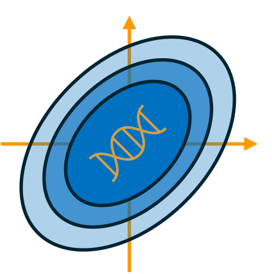

#  TrustPCA

TrustPCA is a webtool that implements a probabilistic framework that predicts the uncertainty of SmartPCA projections due to missing genotype information and visualizes the uncertainties in a PC scatter plot.

- **Website:** https://trustpca.streamlit.app/
- **Paper:** a link will be added after acceptance

## Tool specification
- **Input:** Genotype information of (ancient) human individuals based on the Human Origins array, covering $\sim$600.000 sites.
- **Input format:** EIGENSTRAT format.
- **Hint:** In its current version, TrustPCA computes the PC space from modern West Eurasian populations. Therefore, the uncertainty predictions from TrustPCA are only meaningful for (ancient) individuals from West Eurasia from the Mesolithic epoch or later.